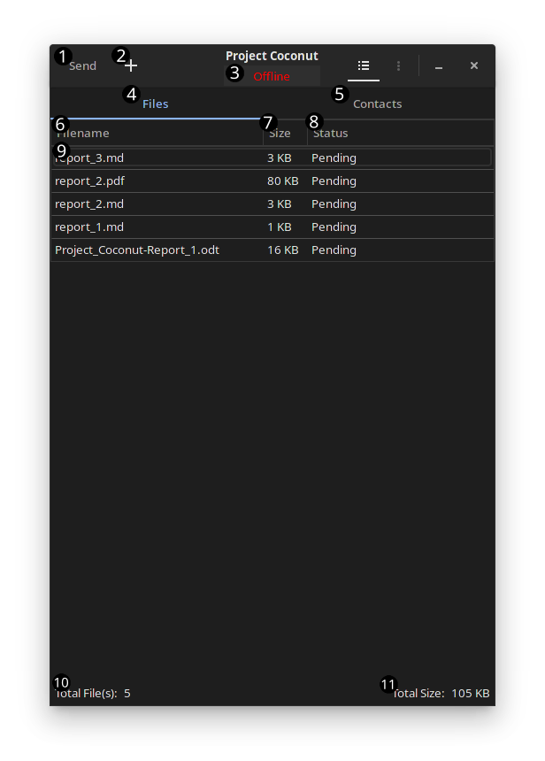
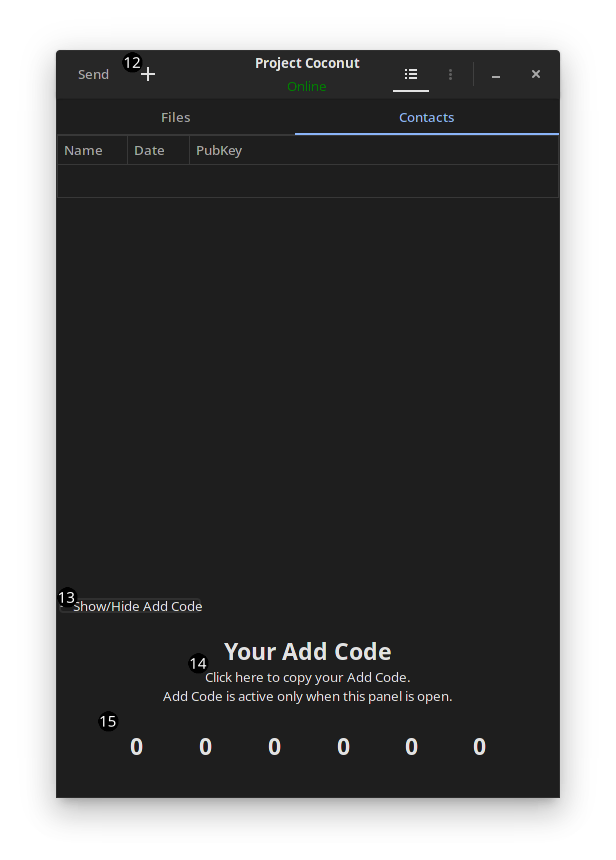

# Capstone Report 3

#### Date: Jul 30, 2021

## Changes

### Implementation

#### **Utility**
- `cryptography` package
  - `EncryptSetup`: Initializes encryption by opening the source file and getting its' information.
  - `DecryptSetup`: Initializes decryption by creating an empty file that will store decrypted data.
  - `Encrypt`: With provided connection (io.writer) and pub/priv keys, encrypts opened file.
  - `Decrypt`: With provided connection (io.writer) and pub/priv keys, decrypts received file.
  - `encryptChunk`, `encryptBytes`: Helper functions for Encrypt.
  - `decryptChunk`, `decryptBytes`: Helper functions for Decrypt.
  - `Close`: Closes initialized files.

  - The following methods were moved from other project, and had minor changes.
    - `genSymKey`
    - `createRSAKey`
    - `OpenKeys`
    - `PemToKeys`
    - `encryptSignSymKey`
    - `decryptVerifySymKey`

- `util` package
  - `ReadBytesToWriter`: Reads bytes and forwards them to the writer using a buffer.
  - `readWrite`: Using buffer from `sync/pool`, read bytes and pass them to the writer. Benchmarks show improvements compared to the previous implementation. pool buffer is intended to be used across the utility class--other functions can use the same buffer pools.
  - `commands` package contains commands shared between clients and a server.

#### **Desktop**
- `client` package
  - As mentioned previously, encryption-related methods are now moved to util package.
  - GUI is being implemented. Currently implements most of the core functions required to fully use the application, but still requires more work in UI/UX design.
  - The current interface and brief function descriptions can be found in the [GUI section](#gui) of this document.
  - TLS implementation is added.
  - Currently working on handlers/command implementations.

#### **Server**
- `server` package
  - `init`: Initializes logger and a random number generator seed.
  - `initAddCode`: Initialize and shuffle list, which contains unique 6 digit codes, called "Add Code".
  - `InitConfig`: Initializes server configuration and returns required structure.
  - `tlsConfig`: Initialize TLS related configurations.
  - `ReadConfig`: Initialize/read configurations from a file.
  - `removeDevice`: Removes a device from the "online" list, preventing other devices from accessing this device.
  - `removeAddCode`: Removes a device from the "addable" device list with provided key hash, preventing other devices from adding this device with Add Code.
  - `addDevice`: Adds a device to the "online" list, allowing other devices to send data to this device, if already added.
  - `getAddCode`: Adds a device to the "addable" device list with provided key hash, allowing other devices to add this device with Add Code. This function returns generated Add Code.
  - `handleInit`: Handles initialization (switching online). (WIP)
  - `handleQuit`: Handles QUIT command. (WIP)
  - `handleGetAddCode`: Handles GADC command. (WIP)
  - `handleRemoveAddCode`: Handles RADC command. (WIP)
  - `handleRequestRelay`: Handle RELY command. (WIP)
  - `handleGetPubKey`: Handles GPUB command. (WIP)
  - `writeResult`: Signal clients the result of each command. (WIP)
  - `connectionHandler`: Parse commands and invoke appropriate functions. (WIP)
  - `Start`: Start the server and allow clients to connect to the server. (WIP)

### GUI

  
   

1. Send selected files to the receiver
2. Add files (if the user is on the Files tab)
3. Button to switch status (online-offline)
4. Activate `Files` tab
5. Activate the `Contacts` tab
6. Filename column, a click will sort items based on the file name.
7. File size column, a click will sort items based on the actual file size.
8. File sent status column, a click will sort items based on the status.
9. Each row represents an item. Users may select single or multiple items and press the delete key to remove items from the list.
10. Indicates the total file count. Selection from 9 does not affect this result.
11. Indicates the total file size. Selection from 9 does not affect this result.
12. Add devices by Add Code (if the user is on the Contacts tab)
13. Button to show/hide Add Code. Activating this button also signals the server to mark the current device as "addable". Deactivating signals the server to remove the current device from the "addable" list.
14. Button to copy Add Code
15. Current Add Code

## Planned
- Fully implement handlers
- Fully implement commands
- Connect functions to GUI
- Add more GUI components
- License: `AGPL` or `ISC` licenses are being considered.

## Status on Previous Issues
- We have noticed some of the issues while implementing some encryption functions, such as some built-in functions lacking support for stream interfaces which is necessary for large files.
  - Implemented wrapper functions to divide files into chunks so that each chunk can be encrypted separately. While this approach prevents the use of streamable interfaces (io.Reader, io.Writer, etc) but it resolves the issue. If streamable interfaces are required, refer to https://pkg.go.dev/crypto/cipher#Stream for other options. Other options (options that are provided by `crypto` package) lack authentication, thus require developers to implement authentication as well.

## Encountered Issues
- Current design of handlers/commands is not flexible enough to work with errors or failures. I am planning to fix this issue until the next report is due, however.