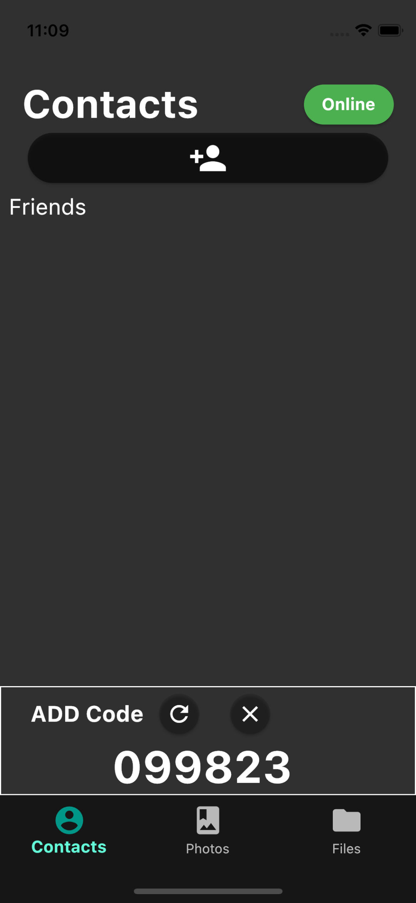
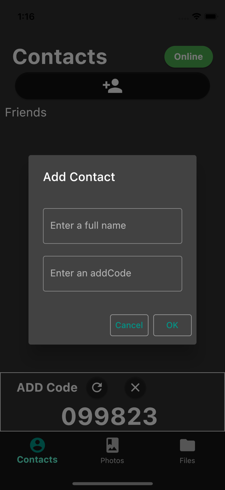
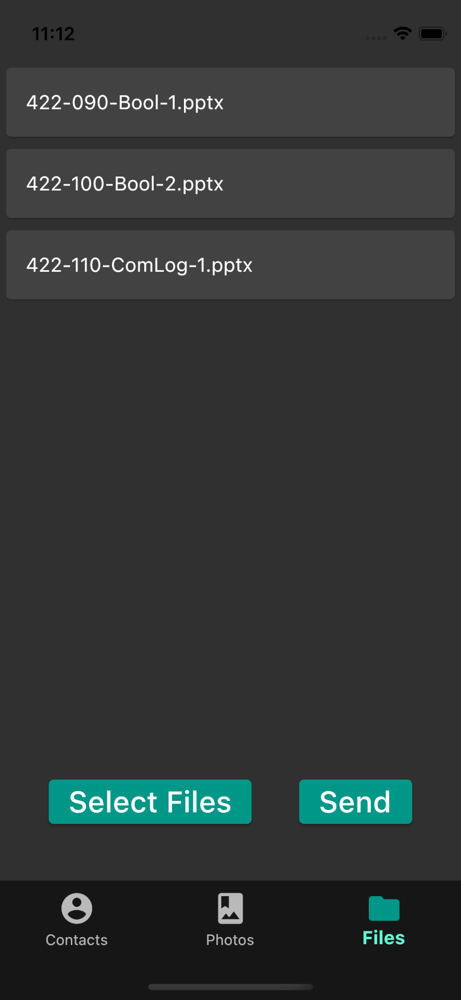

# Capstone Report 4

#### Date: Sep 30, 2021

## Changes

### Implementation

#### **Mobile**

- aes_gcm_encryption.dart
    - `encryptSetup` : Opens file using file path and determines number of chunks.
    
    - `decryptSetup` : Creates temporary file to store decrypted file.

    - `encrypt` : Encrypts file with receiver's pub key and sign with senders' private key.

    - `_encryptChunk`, `_encryptBytes` : Helper function for `encrypt`.

    - `_decryptChunk`, `_decryptBytes` : Helper function for `decrypt`.
    
    - `decrypt` : Decrypts encrypted data from connection. Receiver's private key is required to decrypt symmetric encryption key.

    - `close` : closes the file.

- front_page.dart
    **Key Features**
    - BottomNavigationBarItem - Creates the bottom taps(Contacts, Photos, Files) to switch the tap

    - IndexedStack - Holds a stack of widget but shows only one at a time. All the state is preserved. Example: user types other user name and switch to different tap and came back to the contact tap again. It still saves the previously entered text

- contacts_page.dart
    - **Please look at the bottom image**
    - Added feature that prevents multiple clicks on button

  
  

- phots_page.dart
    - **Please look at the bottom image**

  

- files_page.dart
    - **Please look at the bottom image**

  

#### **Desktop**

- client.go - Contacts
  - `ReadContactsFile`: read or create and encode a go binary file containing a slice of contacts
  - `WriteContactsFile`: encode and write the current slice of contacts to 'contacts.gob'
  - `addContact`: adds a contact to the contacts slice within client (unsorted order)
  - `removeContact`: removes the contact based on the specified pubkey hash
  - `removeContactHelper`: assists in replacing the element to be deleted with the last element in list
  - `findContact`:  finds the contact specified by the provided pubkey hash
  
- client.go - HolePunching
  - `DoRequestP2P`: Sends a request to the server asking to connect to another peer directly
  - `DoSendLocalIP`: Send host ip address and port to server to be sent to peer
  - `DoOpenHolePunch`: *Work in progress* Initiates the HolePunching process and connects host to peer

#### **Server**
- server.go - HolePunching
  - `handleInitP2P`: facilitates the beginning of the HolePunching process by gathering the pubkey of peer to be connected to and distributing public and private ip addresses
  - `handleGetLocalIP`: handle receiving the local ip address from client

### Other
- Finalized the plan for implementing the main listening stream